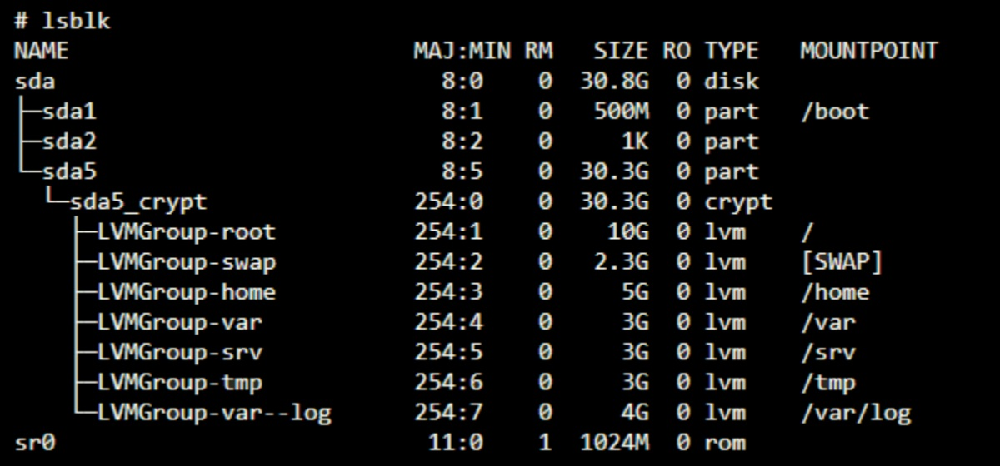

# born2beroot

## 가상머신(Virtual Machine)

- 컴퓨터 내의 컴퓨터처럼 작동하는 가상 환경 즉, 컴퓨터를 에뮬레이션 하는 소프트웨어
- 실제 컴퓨터와 가상 컴퓨터는 호스트(실제 컴퓨터)와 게스트(가상 컴퓨터)의 관계를 가짐
- `Hypervisor`가 VM 생성을 담당합니다. (VM 동작 방식)
  - 시스템 하드웨어에서 VM 리소스를 분리하고 VM이 이러한 리소스를 사용할 수 있도록 필요한 구현을 담당
- 가상머신의 사용 목적
  - 하드웨어 상에는 운영체제가 하나만 존재할 수 있지만, 단일 하드웨어에서 다수의 운영체제를 사용할 수 있게 해준다.

## Debian과 CentOS

- `Debian` : 온라인 커뮤니티에서 제작한 리눅스 기반의 오픈소스 운영체제
  - 커뮤니티 유저가 많고 사용이 쉽다. 다양한 패키지를 지원한다.
  - `Ubuntu`가 Debian을 기반으로 함
- `CentOS` : 래드햇의 RHEL 기반의 리눅스 오픈소스 운영체제
  - RHEL 운영체제의 무료버전으로 가볍지만, 설정이 어렵고 지원하는 프로그램이 적고, 서버를 운용하는 도중 어떠한 문제 발생 시 그것을 해결하기 위해 지원을 받을 수 없다.
  - `Rocky` : 기업 배포판인 CentOS의 정신적 후속작으로, 업데이트 주기가 느리고 기업용이기 때문에 커뮤니티 규모가 상대적으로 작음

## Apt(Advanced Packaging Tool)와 Aptitude

- 설치, 제거, 검색 등의 패키지 관리를 담당하는 도구
- `APT` : 소프트웨어 설치 및 제거를 정상적으로 처리하는 무료 오픈소스 소프트웨어로 GUI가 없는 전체 명령줄
  - `apt` 와 `apt-get` 의 차이점
    - `apt-get`: 패키지 설치, 업데이트 및 제거하는 저수준 프론트엔드 도구, 오래된 명령어라 옵션이 다양함
    - `apt`: 'apt-get'의 결함 중 일부를 수정하여 설계됨. `apt-get`, `apt-cache`, `dpkg -l`의 기능 결합

- `Aptitude` : UI를 추가하여 사용자가 대화형으로 패키지를 검색, 설치, 제거할 수 있는 고급 패키지 도구, 기능이 더 많고 강력한 검색 기능을 제공함

## AppArmor(Application Armor) 와 SELinux(Security-Enhanced Linux)

- `AppArmor`(Debian)
  - 시스템 관리자가 프로그램 프로필 별로 프로그램의 역량을 제한할 수 있게 해주는 리눅스 커널 보안 모듈
  - 강제 접근 제어(MAC)을 제공해 Unix 임의 접근 제어(DAC)를 보완
  - 프로그램 단위의 보안 설정
  - 파일 경로를 통해 작동
- `SELinux`(CentOS) : 강제 접근 제어(MAC)를 포함한 접근 제어 보안 정책을 지원하는 리눅스 커널 보안 모듈
  - 강제 접근 제어(MAC)
  - 시스템 전체에 보안 설정
  - 파일에 라벨을 적용해 작동 (i-Node번호로 파일 시스템 객체 구별)

> `DAC`(Discretionary Access Control): **임의 접근 제어**, 소유자가 파일 제어, 계정과 소유권에만 기반 
> `MAC`(Mandatory access control): **강제 접근 제어**, 정책이 사용자와 행동 제어, 정책이 사용자와 행동 제어, 파일 유형, 사용자 역할, 프로그램의 기능 및 신뢰도, 데이터 민감성과 무결성 고려

## UFW(Uncomplicated Firewall)

- 데비안 계열 및 다양한 리눅스 환경에서 작동되는 방화벽 관리 프로그램
- 복잡하지않은 방화벽, 리눅스 환경에서 쉽게 방화벽을 사용할 수 있게 해준다.
- 프로그램 구성에는 `iptable`를 사용

> 방화벽: 보안 규칙에 따라 네트워크 접근을 제어하는 프로그램

## SSH(Secure Shell Protocol)

- 공용 네트워크를 통해 서로 통신을 할 때 안전하게 통신하기 위해 사용하는 Protocol
- 대칭 키, 비대칭 키, 해시 방식을 사용한다.
  - 대칭 키 암호화 : 암/복호화에 사용하는 키가 동일
  - 비대칭 키 암호화 : 암/복호화에 사용하는 키가 서로 다름
  - 해시 : 임의의 길이를 갖는 임의의 데이터를 고정된 길이의 데이터로 매핑하는 단방향 함수

## Partition 구조

- Bonus Partition 구조

  

- MAJ:MIN(Major:Minor) : 주 번호:부 번호, 커널이 장치 유형에 따라 사용하는 내부 식별자
- RM : 장치 제거 가능 여부 (1(True) || 0(False))
- RO : 읽기 전용 여부 (1(True) || 0(False))
- MOUNTPOINT
  - /boot: 커널이 저장되어 있는 디렉토리
  - [SWAP]: 가상 RAM
  - /home: 시스템 계정 사용자들의 홈 디렉토리와 ftp, www 등과 같은 서비스 디렉토리들이 저장
  - /var: 시스템에서 사용되는 동적인 파일들이 저장
  - /srv: 시스템이 제공하는 서비스를 위한 파일
  - /tmp: 임시파일들이 저장되는 곳
  - /var/log: 프로그램들의 로그 파일들이 저장되는 디렉토리

## LVM(Logical Volume Manager)

- 파티션으로 디스크를 분할하면, 파일시스템이 파티션 별로 존재해 서로 용량을 주고 받을 수 없음.
- 물리적 스토리지 이상의 추상적 레이어를 생성해서 논리적 스토리지(가상의 블록 장치)를 생성할 수 있게 해주는 프로그램
- 볼륨(Volume)이라는 단위로 저장 장치를 다루며, 물리 디스크를 볼륨 그룹으로 묶고 이것을 논리 볼륨으로 분할하여 관리

- Physical Volume : `PV`, 기존의 디스크와 비슷한 물리 공간이지만 LVM의 개념이고 'PE'라는 단위로 나누어져 있음
  - 기존의 디스크는 섹터(Sector)라는 단위로 나누어져 있음
- Physical Extent : `PE`, 기본으로 설정된 크기는 4MB, 단위 통일을 위해서 최소 단위를 정하고 전체 공간을 분할
- Volume Group : `VG`, 'PV'를 모아 만들어진 그룹, 'LV'로 할당가능한 공간
- Logical Volume : `LV`, 'VG'에서 필요에 따라 만들어서 사용, 논리적인 파티션으로 'LE'로 분할됨
- Logical Extent : `LE`, 'LV'가 나누어진 일정 크기의 블록으로, PE와 1대1로 대응된다.

- 장점
  - 유연한 용량 조절
  - 크기 조정이 가능한 스토리지 풀(Pool)
  - 편의에 따른 장치 이름 지정
  - 디스크 스트라이핑
  - 미러 볼륨

## SUDO(Superuser Do)

- 유닉스 및 유닉스 계열 운영체제에서 root권한을 빌려 프로그램을 구동할 수 있도록 하는 프로그램
- root권한이 매우 강력하기 때문에 root비밀번호 사용을 최소화, 로그를 통해 사용 추적 등의 보안상의 이유로 사용함

## TTY(Teletypewriter)

- Console, CLI, CUI : 컴퓨터를 조작할 때 사용하는 입출력 장치
- Terminal 또한 콘솔의 한 종류
- TTY는 콘솔의 한 종류로, OS에서 제공하는 가상콘솔
- 리눅스 환경은 기본적으로 TTY위에 그려져 있다.

> requiretty: tty를 할당 받지 않은 shell에서는 sudo를 사용하지 못하게 하는 옵션

## CRON

- 특정 시간,특정 간격으로 특정 작업을 자동적으로 수행시키는 백그라운드 프로세스(데몬)
- Windows의 스케줄러와 비슷한 역할
- `crontab`(cron table): 실행 규칙에 대한 파일
  - `crontab -e`: 작업을 등록, 수정
  - `crontab -l`: 설정된 내용들을 출력
  - `crontab -r`: 설정된 내용 삭제

> 데몬(daemon): 시스템이 처음 가동될 때 실행되는 백그라운드 프로세스의 일종으로, 메모리에 존재하면서 특정 요청이 올때까지 대기중인 프로세스

### monitoring.sh

- `monitoring.sh`는 서버 상태 정보를 수집해 과제에서 요구하는 형식으로 출력하는 Bash Script.
- 서버가 시작된 뒤 `cron`에 의해 10분마다 실행되며, `wall`을 사용하면 현재 접속 중인 모든 터미널에 같은 내용을 표시할 수 있다.
- 스크립트 실행 중 에러가 화면에 보이면 안 된다.

> 실제 스크립트: [monitoring.sh](./monitoring.sh)

## Bonus

### lighttpd

- Youtube, Wikipedia 등에서 사용하는 경량 웹 서버
- 다른 웹 서버로는 Apache(Apache), IIS(Microsoft), Nginx(NGINX, Inc), GWS(Google)

> Web Server : 서버에 접속한 사용자에게 웹 서비스를 제공하기 위하여 사용되는 서버의 한 종류로, HTTP로 인터넷 브라우저와 통신 
> HTTP 통신의 경우 일반적으로 80번 포트 
> HTTPS 통신의 경우 일반적으로 443번 포트

### PHP: Hypertext Preprocessor

- 대표적인 서버 사이드 스크립트 언어로, 동적 웹 페이지를 쉽고 빠르게 만들 수 있도록 해준다.
  - HTML 코드 안에 추가하면, 웹 서버는 해당 PHP 코드를 해석하여 동적 웹 페이지를 생성
- 주요 운영체제와 대부분의 웹 서버에서 지원하며, 직관적으로 코드를 작성할 수 있어서 코드가 적고, HTML 문서 처리에 적합하다.
- 복잡한 사이트에는 비 효율적이고, 보안에 안전하지 않은 언어다.
- C-like 문법으로, 유사 언어로는 Perl, Ruby 등이 있다.
- 요즘에는 PHP를 분리해서 작성하는 것이 일반적이며, 따로 작성된 PHP는 웹서버가 아닌 PHP-fpm을 통해 실행

> `PHP-fpm`: PHP FastCGI Process Manager, 보통의 CGI보다 빠른 버전 
> `CGI`: Common Gateway Interface, 동적인 페이지 구현을 위한 프로그램에 클라이언트의 요청을 전달해주는 프로그램

### MariaDB

- 오픈소스 DataBase Management System(DBMS)
- MySQL이 Oracle에 인수되면서, MySQL 개발자들이 나와서 만듬
- MySQL과 동일한 소스코드 기반
- GPLv2 라이선스를 따르는 순수 오픈소스 프로젝트

### Wordpress

- 오픈소스를 기반으로 한 설치형 블로그 또는 CMS
- PHP 기반이며 라이선스는 GNU GPLv2
- 수많은 플러그인과 테마, 자유도
- 보안 취약성, 서비스형 블로그와는 달리 호스팅, 도메인이 제공되지 않음

> CMS: Content Management System, 전체 콘텐트 관리 시스템

### Sendmail

- 설치하고 세팅과정이 짧아 구현난이도가 낮아서 선택.
- 인터넷을 통해 이메일을 전송하는데 사용되는 SMTP를 포함하여 수많은 종류의 메일 전송 및 전달 방식을 지원하는, 범용 목적 인터네트워크 이메일 라우팅 기능
- InterNetworking: 두 개 이상의 네트워크를 연결하여 네트워크 간 하드웨어나 소프트웨어 모두를 연결시키는 방법론

> `SMTP`: Simple Mail Transfer Protocol, 이메일 전송에 사용되는 네트워크 프로토콜(간이 우편 전송 프로토콜)
