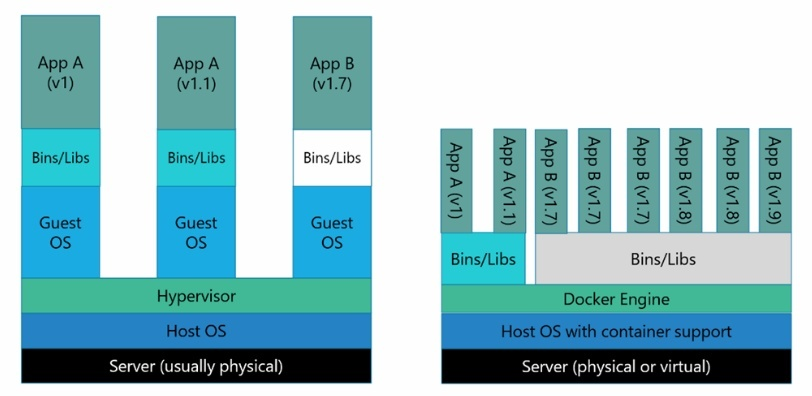

# Inception

## 개요

- Inception은 Docker Compose로 NGINX, WordPress/PHP-FPM, MariaDB를 분리 구성하는 작은 인프라 과제다.
- 핵심은 한 컨테이너에 여러 서비스를 몰아넣지 않고, 각 서비스의 책임을 분리한 뒤 network와 volume으로 연결하는 것이다.
- 컨테이너 실행 환경, 서비스 간 통신, 데이터 보존, entrypoint, 환경 변수 기반 설정을 함께 다룬다.

## 과제 요구사항

### Mandatory

- 프로젝트는 VM에서 진행하며, 모든 설정 파일은 `srcs` 디렉터리 아래에 둔다.
- 루트 `Makefile`은 `docker-compose.yml`을 사용해 전체 애플리케이션을 빌드하고 실행해야 한다.
- 각 Docker image 이름은 대응하는 service 이름과 같아야 하며, 각 service는 전용 container에서 실행되어야 한다.
- 각 service image는 직접 작성한 Dockerfile로 빌드해야 하며, 미리 만들어진 service image나 `latest` tag를 사용할 수 없다.
- Container base image는 Alpine 또는 Debian의 penultimate stable version을 사용해야 한다.
- NGINX container는 TLSv1.2 또는 TLSv1.3만 사용하며, 443 port를 통해 인프라의 유일한 외부 진입점이 되어야 한다.
- WordPress container는 `php-fpm`과 함께 설치 및 설정하되 NGINX를 포함하지 않는다.
- MariaDB container는 MariaDB만 포함하고 NGINX를 포함하지 않는다.
- WordPress database와 website file은 각각 Docker volume으로 보존되어야 한다.
- Container 간 연결은 `docker-network`로 구성하고, `network: host`, `--link`, `links:` 방식은 사용하지 않는다.
- Container는 crash 시 재시작되도록 설정해야 한다.
- Container나 entrypoint는 `tail -f`, `bash`, `sleep infinity`, `while true` 같은 무한 루프 기반 실행 방식으로 유지하면 안 된다.
- WordPress database에는 일반 사용자와 관리자 사용자가 필요하며, 관리자 이름에는 `admin`, `administrator` 계열 문자열을 포함할 수 없다.
- Domain은 local IP를 가리키는 `<login>.42.fr` 형식으로 설정한다.
- Password와 secret 값은 Dockerfile에 직접 쓰지 않고 환경 변수로 주입한다.

## 개념 정리

### Docker

- Docker는 LXC라는 container 기술을 기반으로 만들어진 container 기술이다.

#### LXC (Linux Containers)

- 리눅스 커널을 공유하면서 process를 격리된 환경에서 실행하는 기술이다.
- 운영체제 수준의 가상화 기술이다.
  - 별도의 하드웨어 에뮬레이션 없이 리눅스 커널을 공유해 실행하며, Guest OS 관리가 필요하지 않다.
- 빠른 속도와 효율성을 가진다.
  - 하드웨어 에뮬레이션이 없기 때문에 빠르게 실행된다.
  - 프로세스 격리를 위한 약간의 오버헤드는 있지만 일반적인 process를 실행하는 것과 거의 차이가 없다.
- 높은 이식성을 가진다.
  - Host의 환경이 아닌 독자적인 실행 환경을 가진다.
  - 실행 환경은 파일들로 구성되어 image 형식으로 공유될 수 있다.
  - 같은 Linux kernel과 같은 container runtime을 사용할 경우 container 실행 환경을 쉽게 공유하고 재현할 수 있다.
- 상태를 가지지 않는다.
  - 실행되는 환경이 독립적이기 때문에 다른 container에게 영향을 주지 않는다.

#### VM과 Docker의 차이

- VM은 hypervisor 위에서 guest OS를 실행하는 방식이다.
- Docker container는 host kernel을 공유하면서 격리된 process를 실행하는 방식이다.
- VM은 guest OS를 포함하기 때문에 격리 수준이 강하지만 무겁고, Docker는 guest OS를 따로 관리하지 않기 때문에 더 가볍고 빠르게 실행된다.



### Docker Compose

#### Docker Compose의 목적

- 다중 container 관리
  - 여러 container로 이루어진 application을 쉽게 관리한다.
  - 복잡한 application을 여러 container로 나누고 각각의 설정을 관리한다.
- 설정 관리
  - Docker Compose file을 사용해 application의 환경 설정, service 간 의존성, networking, data volume 등을 정의한다.
- 한 번에 여러 container 시작
  - 여러 service의 container를 한 번에 시작하고 중지할 수 있는 명령을 제공한다.
- 테스트 및 개발 용이성
  - 개발 및 테스트 환경에서 여러 service 간 통합을 용이하게 한다.

#### Docker Engine에서 단일 container 실행과의 차이

- 단일 container와 다중 container
  - Docker Engine으로 단일 container를 실행하면 해당 container만 관리한다.
  - Docker Compose를 사용하면 여러 container를 함께 관리한다.
- Service 간 의존성 및 network 설정
  - Docker Compose를 사용하면 service 간 의존성을 쉽게 설정할 수 있다.
  - 동일한 network에서 container 간 통신이 가능하다.
- 일괄적인 환경 구성
  - Docker Compose는 YAML file을 통해 일괄적인 환경 구성이 가능하다.
  - 여러 설정을 file로 정의하고 필요한 대로 관리할 수 있다.
- 복잡한 application 관리
  - Docker Compose는 복잡한 application을 다수의 container로 나누고, 이들을 한 번에 관리할 수 있도록 하는 도구다.
  - Docker Engine은 단일 container를 실행하고 관리하는 데에 중점을 둔 도구다.

### PID 1

- Dockerfile의 권장 JSON 구문을 사용하지 않고 container 명령을 지정하면, 실행을 위해 명령이 shell에 전달될 수 있다.
- 이 경우 container 내부의 process tree는 다음과 같은 형태가 될 수 있다.

```text
docker run
└── /bin/sh                 # PID 1
    └── python my_server.py # child process
```

- Shell을 PID 1로 사용하면 실제 server process에 signal을 보내기 어려워진다.
- Shell로 전송된 signal은 하위 process로 전달되지 않을 수 있고, 하위 process가 종료될 때까지 shell도 종료되지 않을 수 있다.
- 이를 쉽게 피할 수 없는 경우에는 `exec`로 마지막 process가 shell을 대체하도록 구성한다.

#### Trouble signaling

- Linux kernel은 PID 1을 특별한 경우로 처리하고 signal 처리 방법에 다른 규칙을 적용한다.
- `SIGTERM`을 전달해 container를 중지해도 일반적인 process처럼 동작하지 않을 수 있다.
- `docker stop`은 먼저 `TERM` signal을 보내고 일정 시간 후에도 종료되지 않으면 `KILL` signal을 보낸다.
- PID 1 문제가 있으면 process가 정리할 기회를 얻지 못하고 즉시 중지될 수 있다.

#### Dumb-init

- `dumb-init`은 PID 1 문제를 해결하기 위해 Linux container에서 사용할 수 있는 최소 init system이다.

```bash
CMD ["dumb-init", "python", "my_server.py"]
```

- 이 경우 process tree는 다음과 같은 형태가 된다.

```text
docker run
└── dumb-init               # PID 1
    └── python my_server.py # child process
```

- `dumb-init`은 signal handler를 등록하고 signal을 child process로 전달한다.
- Child process가 종료될 때까지 `dumb-init`도 종료되지 않으므로 적절한 정리를 수행할 수 있다.
- Server process가 더 이상 PID 1로 직접 실행되지 않기 때문에, `TERM` signal을 전달받았을 때 일반적인 기본 동작을 적용받을 수 있다.
- 추가 종속성 없이 정적으로 연결된 binary로 배포할 수 있고, signal 처리를 개선할 뿐 아니라 고아 process와 zombie process 정리도 처리한다.
- 일반 init system을 사용해도 비슷한 문제를 해결할 수 있지만, 복잡성과 resource 사용량이 증가한다.

### Makefile

#### 할당 연산자 `:=`과 `=`

- 간단 할당 연산자 `:=`
  - 변수가 다른 변수에 의존하지 않고 정의될 때 사용한다.
  - 해당 변수의 값은 변수가 정의된 시점의 값으로 고정된다.

```makefile
VAR := initial_value
TARGET := $(VAR) updated_value
VAR := new_value
```

- 위 예시에서 `TARGET`은 `initial_value updated_value`로 설정된다.
- `:=` 연산자는 변수 정의 시점의 값을 사용하기 때문이다.

- 재귀 할당 연산자 `=`
  - 변수가 사용될 때마다 값을 다시 계산한다.
  - 다른 변수에 의존하는 경우 동적으로 값이 변경될 수 있다.

```makefile
VAR = initial_value
TARGET = $(VAR) updated_value
VAR = new_value
```

- 위 예시에서 `TARGET`은 `new_value updated_value`로 설정된다.
- `=` 연산자는 변수가 사용될 때마다 값을 다시 계산하기 때문이다.
- 일반적으로 변수가 한 번 정의되고 나면 값이 변경되지 않아야 하는 경우에는 `:=`를 사용하고, 변수가 동적으로 변경될 수 있는 경우에는 `=`를 사용한다.

## 설계 포인트와 구현 방식

### Compose 기반 서비스 분리

- 설계 포인트: NGINX, WordPress, MariaDB는 서로 다른 책임을 가지므로 각각 전용 container로 분리해야 한다.
- 구현 방식: `srcs/docker-compose.yml`에서 `mariadb`, `wordpress`, `nginx` 세 service를 각각 정의했다.
- 세 service는 모두 `env_file: .env`를 사용하고, `restart: always`로 crash 시 재시작되도록 설정되어 있다.
- `intra` bridge network를 만들어 container 간 통신을 구성했다.
- `wordpress`는 `mariadb`에, `nginx`는 `wordpress`에 `depends_on`으로 연결되어 있지만, 이는 시작 순서만 지정하고 service 준비 상태까지 보장하지는 않는다.

### NGINX 단일 진입점

- 설계 포인트: 외부 요청은 443 port의 NGINX만 받을 수 있어야 하고, WordPress와 MariaDB는 내부 network를 통해서만 연결되어야 한다.
- 구현 방식: `nginx` service만 `443:443` port를 열고, `nginx/Dockerfile`은 `debian:bullseye` 기반으로 `nginx`와 `openssl`을 설치한다.
- Build 과정에서 self-signed certificate와 key를 생성하고, NGINX 설정 파일을 `/etc/nginx/sites-available/default`로 복사한다.
- NGINX 설정은 443 SSL port에서 TLSv1.2와 TLSv1.3만 허용한다.
- `server_name`은 `seojulee.42.fr`로 설정되어 있고, PHP 요청은 `fastcgi_pass wordpress:9000`으로 WordPress container에 전달된다.
- Entry point는 `ENTRYPOINT ["nginx", "-g", "daemon off;"]`로 NGINX를 foreground 실행한다.

### WordPress 초기화와 PHP-FPM

- 설계 포인트: WordPress container는 WordPress와 PHP-FPM만 담당하고, NGINX를 포함하지 않아야 한다.
- 구현 방식: `wordpress/Dockerfile`은 `debian:bullseye` 기반으로 `php7.4`, `php-fpm`, `php-mysql`, `php-cli`, `wget`, `curl`, `dumb-init`을 설치한다.
- `wp-cli.phar`를 내려받아 `/usr/local/bin/wp`로 설치하고, 기본 PHP-FPM pool 설정을 제거한 뒤 `conf/www.conf`를 복사해 `wordpress:9000`에서 listen하도록 설정한다.
- `entrypoint.sh`는 `/var/www/wp-config.php`가 없을 때만 WordPress core download, config 생성, core install, author user 생성을 수행한다.
- 이 방식은 volume을 재사용할 때 WordPress가 중복 설치되는 상황을 피하기 위한 조건부 초기화다.
- 초기화 후 `/var/www` 권한을 `www-data:www-data`와 `755`로 정리하고, `exec php-fpm7.4 -F`로 PHP-FPM을 foreground 실행한다.

### MariaDB 초기화와 database service

- 설계 포인트: MariaDB container는 database service만 담당하고, WordPress에서 사용할 database와 user를 server 실행 전에 준비해야 한다.
- 구현 방식: `mariadb/Dockerfile`은 `debian:bullseye` 기반으로 `mariadb-client`, `mariadb-server`, `dumb-init`을 설치한다.
- `/var/run/mysqld`를 만들고 owner와 권한을 설정한 뒤, `my.cnf`와 `entrypoint.sh`를 복사한다.
- `my.cnf`는 MariaDB가 `0.0.0.0:3306`에서 연결을 받을 수 있게 설정한다.
- `entrypoint.sh`는 `mysql_install_db --user=root`로 초기 database directory를 준비한다.
- Bootstrap SQL로 database 생성, 일반 user 생성, 권한 부여, root password 변경을 수행한 뒤 `mysqld -uroot`를 실행한다.

### Foreground process와 PID 1

- 설계 포인트: container는 실제 server process가 살아 있는 동안 유지되어야 하며, `tail -f`, `sleep infinity`, `while true` 같은 방식으로 억지로 유지하면 안 된다.
- 구현 방식: NGINX는 `daemon off`로, WordPress는 `php-fpm7.4 -F`로, MariaDB는 `mysqld -uroot`로 실제 service process를 실행한다.
- WordPress와 MariaDB는 `ENTRYPOINT ["dumb-init", "--", "/entrypoint.sh"]`를 사용해 PID 1 위치에서 signal 전달과 zombie process 정리를 보조한다.
- WordPress는 마지막 실행에서 `exec php-fpm7.4 -F`를 사용해 shell을 PHP-FPM process로 대체한다.

### 데이터 보존과 bind volume

- 설계 포인트: database file과 WordPress website file은 container 생명주기와 분리되어야 한다.
- 구현 방식: `docker-compose.yml`에서 `db_vol`과 `web_vol`을 분리해 정의했다.
- `db_vol`은 host의 `/home/seojulee/data/db`를 container의 `/var/run/mysqld`에 bind한다.
- `web_vol`은 host의 `/home/seojulee/data/wordpress`를 container의 `/var/www`에 bind한다.
- 문서에서는 사용자별 경로를 일반화할 때 `/home/<login>/data`로 표기한다.

### 환경 변수와 secret 분리

- 설계 포인트: database 이름, 계정, password, WordPress 관리자 정보는 Dockerfile에 직접 쓰지 않고 runtime 설정으로 분리해야 한다.
- 구현 방식: `docker-compose.yml`에서 각 service에 `env_file: .env`를 지정해 필요한 값을 주입한다.
- WordPress와 MariaDB의 `entrypoint.sh`는 주입된 환경 변수를 사용해 config, database, user를 초기화한다.
- README에는 `.env`의 존재와 역할만 설명하고 실제 값은 노출하지 않는다.

### Makefile 실행 흐름

- 설계 포인트: 루트 `Makefile` 하나로 필요한 directory 생성, image build, container 실행, 정리 작업을 수행할 수 있어야 한다.
- 구현 방식: `Makefile`은 `docker-compose -f ./srcs/docker-compose.yml`을 기준 명령으로 사용한다.
- `all` target은 `/home/seojulee/data`, `/home/seojulee/data/db`, `/home/seojulee/data/wordpress`를 만든 뒤 `docker-compose up -d --build`를 실행한다.
- `log`는 Compose log를 출력하고, `info`는 container, image, volume 목록을 확인한다.
- `clean`은 Compose service를 중지하고, `fclean`은 Docker system prune, volume 제거, data directory 제거까지 수행한다.

## 폴더 구조

```text
.
├── Makefile
└── srcs/
    ├── .env
    ├── docker-compose.yml
    └── requirements/
        ├── mariadb/
        │   ├── Dockerfile
        │   ├── conf/
        │   │   └── my.cnf
        │   └── tools/
        │       └── entrypoint.sh
        ├── nginx/
        │   ├── Dockerfile
        │   └── conf/
        │       └── default
        └── wordpress/
            ├── Dockerfile
            ├── conf/
            │   └── www.conf
            └── tools/
                └── entrypoint.sh
```

- `srcs/docker-compose.yml`: service, network, volume 정의
- `requirements/*/Dockerfile`: service별 image build 정의
- `conf/`: service별 설정 파일
- `tools/entrypoint.sh`: container 시작 시 초기화 흐름

## 빌드 및 실행

### 빌드

```bash
make
```

- `make`는 필요한 data directory를 만들고 `docker-compose up -d --build`를 실행한다.
- 실행 전 `srcs/.env`와 `<login>.42.fr` domain/hosts 설정이 필요하다.

### 실행

```bash
make log
make info
make clean
make fclean
make re
```

- `make log`: Compose log 확인
- `make info`: container, image, volume 상태 확인
- `make clean`: Compose service 중지
- `make fclean`: service 중지 후 Docker resource, volume, data directory 제거
- `make re`: 전체 정리 후 다시 build 및 실행

## 참고 자료

- [Docker/Docker Container와 Docker Image](https://sunrise-min.tistory.com/entry/Docker-Container%EC%99%80-Image%EB%9E%80-%EB%AC%B4%EC%97%87%EC%9D%B8%EA%B0%80)
